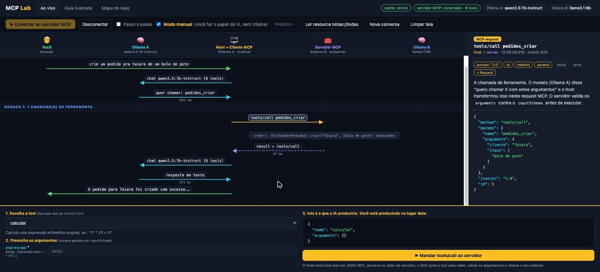

# MCP Lab

Laboratório para **aprender o Model Context Protocol (MCP) vendo o protocolo acontecer**.
Um Host com cliente MCP, um servidor MCP na frente de um "sistema legado", e um micro site
que desenha cada mensagem JSON-RPC como uma seta num diagrama de sequência. Tudo local:
Node + Ollama.



```
 🧑 Você ──► 🖥️ Host + Cliente MCP ──(JSON-RPC por stdio)──► 🧰 Servidor MCP
                │                                              │
                └─► 🧠 Ollama A (decide)                       └─► 🧠 Ollama B (especialista)
             Sistema A · src/host                           Sistema B · src/server
```

## Rodando

Pré-requisitos: Node 22+, [Ollama](https://ollama.com) rodando com dois modelos que suportem
tool calling. Padrão: `qwen2.5:7b-instruct` (host) e `llama3.1:8b` (servidor).

```bash
npm install
npm run dev        # abre http://localhost:4321
```

No site: clique em **Conectar** para ver o handshake (`initialize` → `initialized` → `tools/list`),
depois faça uma pergunta. Ative **Passo a passo** para liberar uma mensagem por vez (seta → do teclado também funciona).
Clique em qualquer seta para ver o JSON bruto e a explicação daquela mensagem.

**Modo manual (recomendado para entender a arquitetura):** marque **Modo manual** na barra.
Você faz o papel da IA: escolhe a tool na lista do `tools/list`, preenche os argumentos (campos gerados
do `inputSchema`) e manda o `tools/call`. Nenhum modelo envolvido. Mostra que a IA só produz
`{name, arguments}`; o resto é código determinístico.

Outros modos:

| Comando | O que faz |
|---|---|
| `npm run cli` | Mesmo lab no terminal. `VERBOSE=1 npm run cli` imprime o JSON de cada mensagem. |
| `npm run server` | Só o servidor, lendo JSON-RPC no stdin. Cole um `initialize` na mão. |
| `npm run inspector` | MCP Inspector oficial apontando para este servidor. |
| `OLLAMA_MODEL=llama3.1:8b OLLAMA_MODEL_B=qwen2.5:7b-instruct npm run dev` | Troca os modelos. |

## O que tem em cada arquivo

| Arquivo | Papel |
|---|---|
| `src/server/index.ts` | **Sistema B.** Servidor MCP com 5 tools, 2 resources, 1 prompt e logging. A tool `consultar_especialista` chama o Ollama B. |
| `src/host/agent.ts` | **Sistema A.** `Client` do SDK + loop agentico com Ollama A: `tools/list` vira `tools` do Ollama, `tool_calls` vira `tools/call`. |
| `src/shared/tap-transport.ts` | O "grampo": embrulha o `StdioClientTransport` e observa cada `JSONRPCMessage` nas duas direções. |
| `src/shared/ollama.ts` | `fetch` para `/api/chat` do Ollama com suporte a tools. |
| `src/bridge/index.ts` | HTTP + WebSocket. Serve `web/` e retransmite os eventos do Agent ao browser. |
| `src/host/cli.ts` | Versão terminal. |
| `web/` | O site: diagrama SVG, inspetor, guia ilustrado. Sem framework. |

## O que dá para aprender aqui

1. **Papéis**: Host, Client e Server. O modelo nunca fala MCP; o Client fala por ele.
2. **Transporte stdio**: o servidor é um processo filho, um JSON por linha, e `console.log` quebra tudo (stdout é o canal do protocolo).
3. **JSON-RPC 2.0**: request (id + method), response (id + result/error), notification (method sem id).
4. **Ciclo de vida**: `initialize` → `notifications/initialized` → descoberta → uso.
5. **Primitivas**: tools (modelo decide), resources (app decide), prompts (usuário decide).
6. **Onde o LLM entra**: a tradução MCP ⇄ function calling que o host faz.
7. **MCP é uma fronteira**: do outro lado de um `tools/call` pode haver qualquer coisa, inclusive outro modelo.

## Estrutura

```
src/
├── legado/      sistema que já existe (sem IA, sem MCP)
├── server/      servidor MCP + adaptador do legado
├── host/        cliente MCP + loop com Ollama + CLI
├── shared/      TapTransport, cliente Ollama, tipos de evento
└── bridge/      HTTP + WebSocket que alimenta o site
web/             site estático (sem framework)
docs/            anotações e screenshot
```

## Próximos experimentos

- Adicione uma tool nova em `src/server/index.ts`. Ela aparece no `tools/list` sem mexer no host.
- Troque stdio por Streamable HTTP e compare os eventos.
- Faça o servidor usar `sampling/createMessage` (pedir ao modelo do host) em vez de ter o próprio Ollama B.
- Conecte `src/server/index.ts` ao Claude Desktop ou ao Claude Code (`claude mcp add lab -- node --import tsx <caminho>/src/server/index.ts`).

## Licença

MIT.
